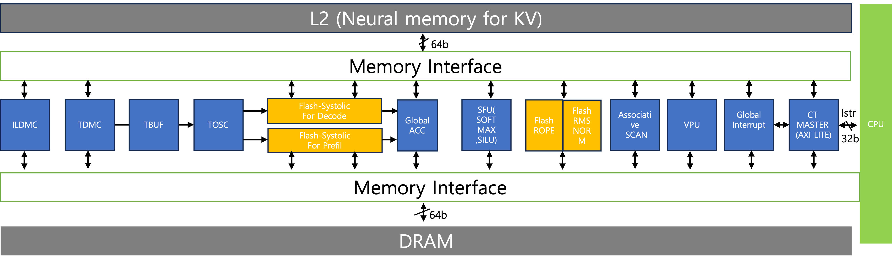
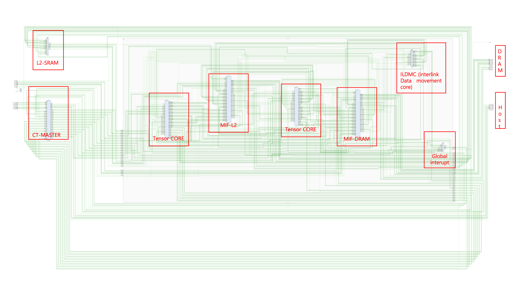
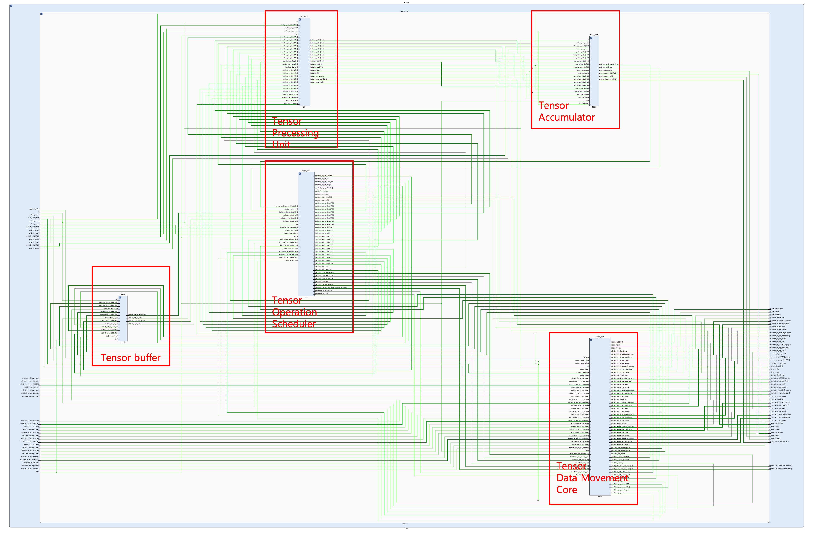
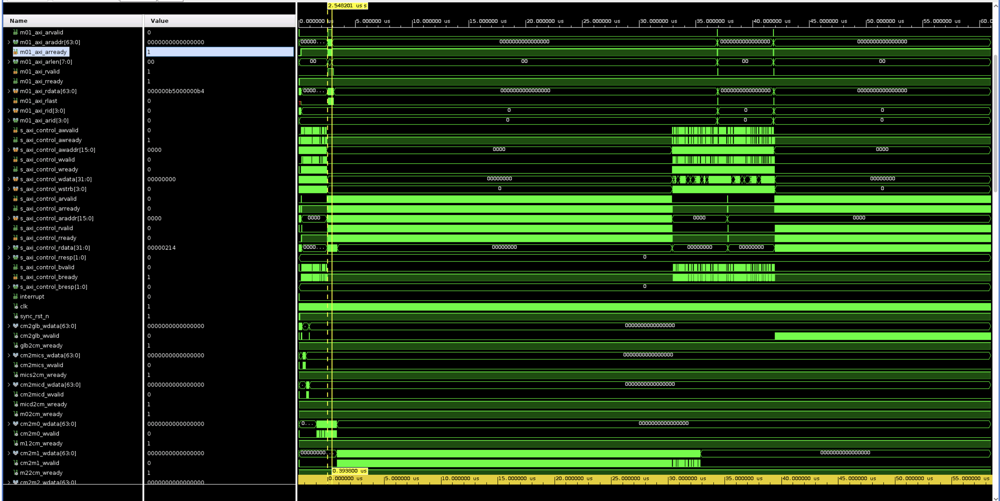
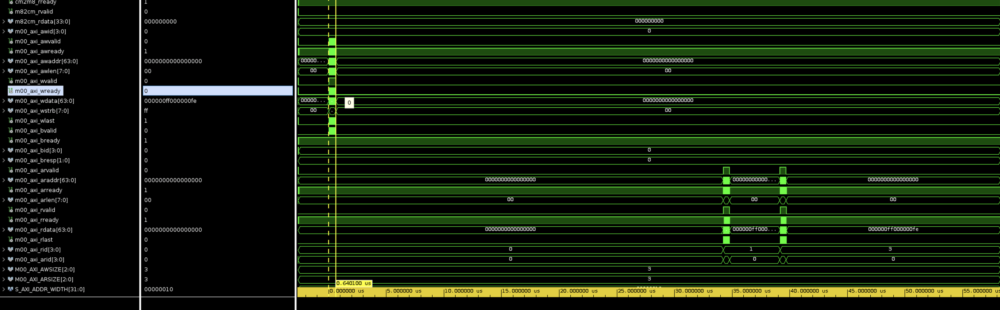

대규모 언어 모델(LLM) 추론은 '프리필(Prefill)'과 '디코드(Decode)'라는, 연산 특성이 극명하게 갈리는 두 단계로 구성됩니다. 프리필 단계는 입력 프롬프트를 병렬로 처리하는 Compute-intensive(연산 집약적) 특성을, 디코드 단계는 토큰을 순차적으로 생성하는 Memory-bound(메모리 집약적) 특성을 보입니다. 기존 가속기들은 종종 이 두 단계 중 한쪽에만 최적화되어, 다른 단계에서는 심각한 비효율과 리소스 유휴 상태를 야기합니다. 특히 디코드 단계에서의 KV 캐시 접근은 전체 추론 속도를 좌우하는 심각한 메모리 병목 현상(memory bottleneck)을 유발합니다.본 논문에서는 이러한 이중의 병목 현상을 해결하기 위해 **TiAccel (Transformer Integrated Accelerator)**을 제안합니다. TiAccel은 LLM 추론의 두 단계를 모두 가속화하기 위해 특화된 이종(heterogeneous) NPU (Neural Processing Unit) 아키텍처를 단일 칩에 통합한 혁신적인 가속기입니다.TiAccel의 핵심 아키텍처는 다음과 같은 두 가지 주요 구성 요소로 이루어집니다.프리필 전용 시스톨릭 어레이 (Prefill-Optimized Systolic Array): 프리필 단계의 대규모 병렬 연산(GEMM)에 최적화되어 높은 연산 처리량(throughput)을 달성합니다.디코드 전용 시스톨릭 어레이 (Decode-Optimized Systolic Array) 및 L2 메모리: 디코드 단계의 순차적 연산(GEMV)에 특화되어 있으며, **대용량의 온칩 L2 메모리 시스템과 긴밀하게 결합(tightly-coupled)**됩니다.  이 L2 메모리는 KV 캐시 데이터를 저장하여, 디코드 유닛이 고비용의 오프칩(off-chip) 메모리 접근 없이 낮은 지연 시간(low latency)으로 KV 캐시에 접근할 수 있게 합니다.이러한 특화된 NPU 유닛의 통합을 통해, TiAccel은 프리필 단계에서는 연산 병목 현상을, 디코드 단계에서는 메모리 병목 현상을 동시에 효과적으로 해결합니다.제안하는 아키텍처의 우수성을 검증하기 위해, 우리는 TiAccel을 Xilinx Alveo U200 FPGA 플랫폼 상에 프로토타입으로 구현하였습니다. [BERT, GPT, LLaMA 등] 다양한 구조와 크기의 트랜스포머 모델을 실행하여 TiAccel의 높은 성능과 범용성(generality)을 입증하였습니다. 평가 결과, TiAccel은 기존 GPU 기반 시스템 및 단일 단계 최적화 가속기 대비 배 향상된 전체 추론 처리량과 배 높은 에너지 효율성을 달성하였습니다.

1. 공정한 논문 심사를 위해 IEEE 1735에 기반한 암호화된 코드를 공개합니다.
    Xilinx Vivado를 사용하여 Simulation,Synthesis,Implementation,Bitstream을 허용합니다.

##Hybrid-T-Accelerator (ongoing)

  
  

  ##Top Architechture
  

  ##Tensor Core
  
  ##interlink data movement core - instr and dram read
  
  ##interlink L2 SRAM WRITE / READ
  

##Xilinx Alveo U200 FPGA 

  

