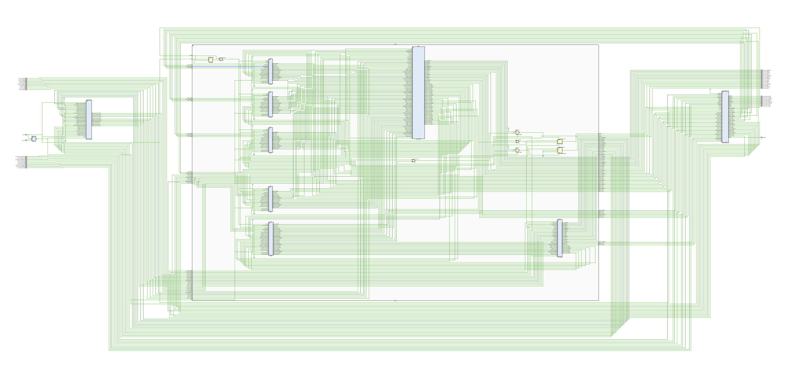

I am currently implementing the Titans _Accelerator in Verilog.
The full architecture will be described in our forthcoming paper submission and made publicly available by September.
The overall architecture—outlined schematically in the figure below—will comprise an on-chip neural memory (SRAM) and a window-based Transformer core.

  >

