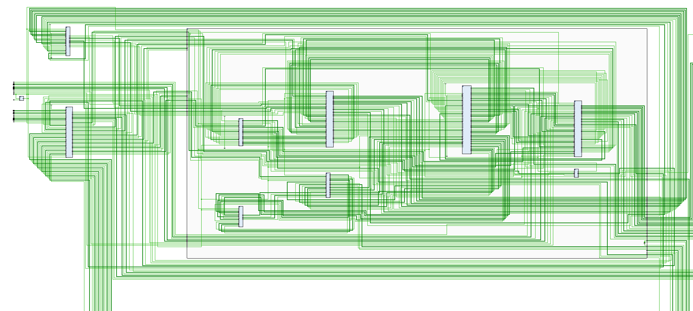
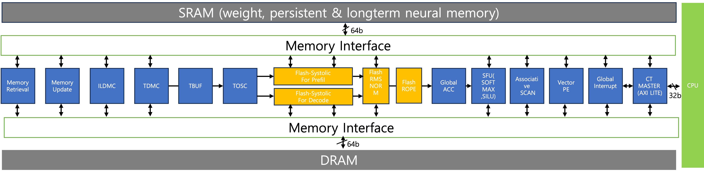
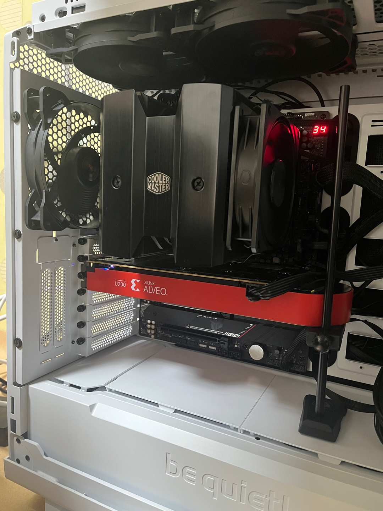

1. Systolic Array-Based LLM NPU with Hybrid Batching Support
A Systolic Array is a parallel processing architecture that is highly efficient for matrix multiplication operations, which are the core computational workload in Large Language Models (LLMs). An NPU (Neural Processing Unit) built with a systolic array is therefore exceptionally well-suited to accelerate LLM inference and training.

Hybrid Batching is an advanced technique used to maximize the efficiency of these NPUs. In a real-world service environment, user requests (queries) have varying lengths. Traditional batching methods struggle with this.

Static Batching: Groups inputs of the same size together. This is efficient but inflexible for varied inputs.

Dynamic Batching: Groups incoming requests together as they arrive, regardless of size, often leading to wasted computation as shorter sequences in a batch finish early.

Hybrid batching combines the benefits of both approaches. It groups similarly-sized requests into static batches and then dynamically schedules these different batches to run in parallel across the NPU's processing units.

The primary advantages are significantly increased throughput (more requests processed per second) and reduced latency (faster response times). This makes the NPU far more efficient by minimizing idle time, which is critical for deploying responsive and cost-effective LLM services.

2. Memory Transformer Architecture
The Memory Transformer is an architecture designed to overcome a fundamental limitation of the standard Transformer model: its fixed context length. A standard Transformer can only process a limited amount of information at once and cannot recall information from inputs that came before its fixed window.

To solve this, the Memory Transformer integrates both long-term and short-term memory systems.

Short-Term Memory: This is handled by a standard Transformer. It processes the current segment of input data, using its attention mechanism to understand the complex relationships within that immediate context.

Long-Term Memory: This is managed by an RNN-based Neural Memory. As the Transformer processes each segment, key information is compressed and stored in this external memory. When processing a new segment, the Transformer has access not only to the current input but also to the summarized history stored in the RNN memory.

How it works: The architecture processes a long sequence segment by segment. After each segment is processed by the short-term Transformer, its state is used to update the long-term RNN memory. For the next segment, the Transformer uses both the new input and the context from the long-term memory.

This dual-memory system allows the model to maintain a coherent understanding of information across a much longer sequence, far beyond the limits of a standard Transformer. This is crucial for applications like summarizing long documents, generating chapter-length stories, or maintaining context in extended conversations.

##Hybrid-T-Accelerator (ongoing)

  
  

##Xilinx Alveo U200 FPGA 

  

